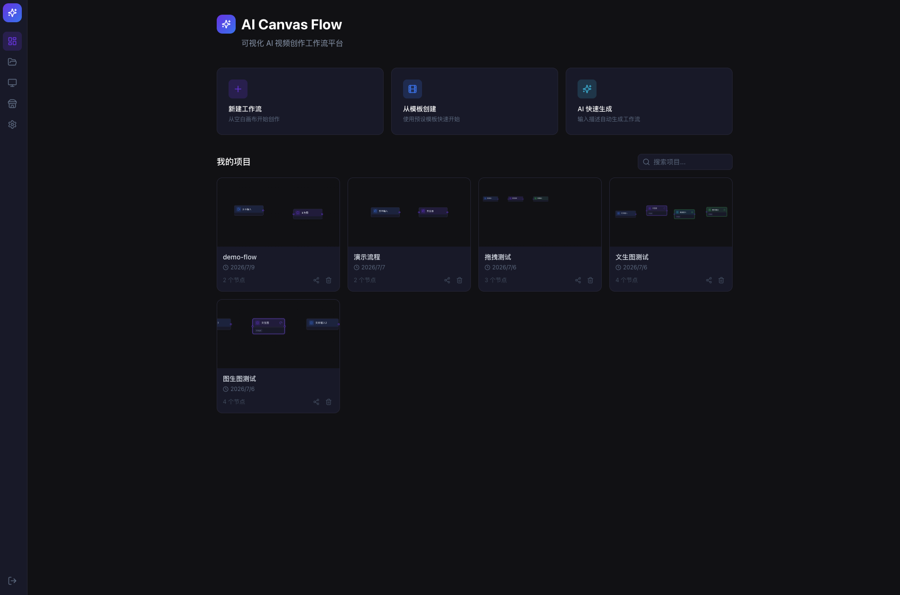
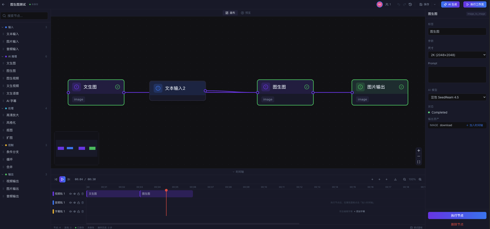
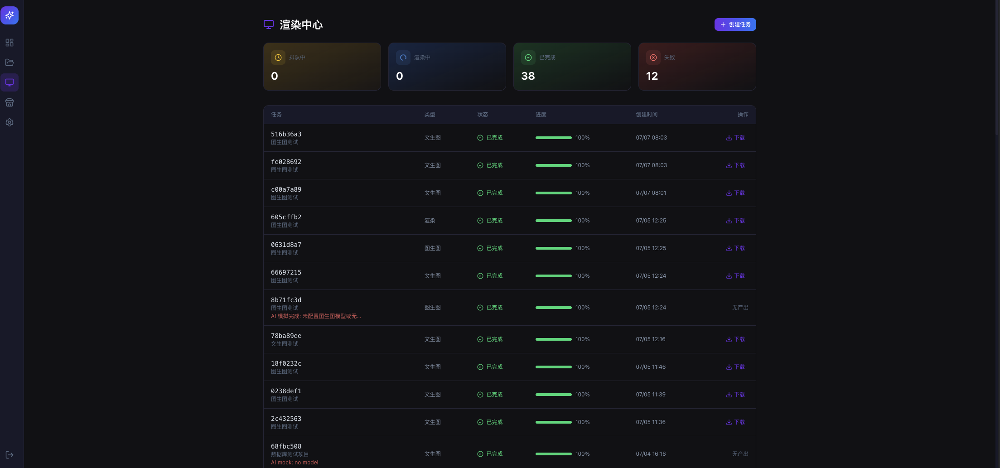
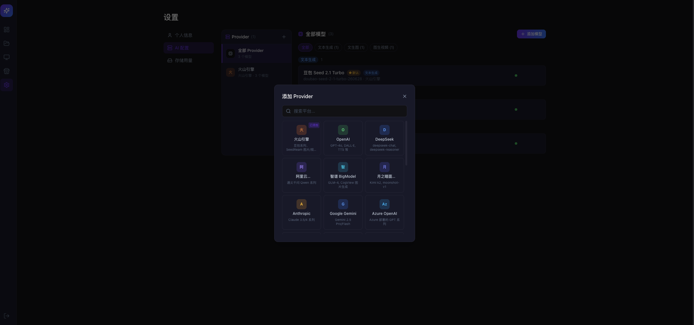
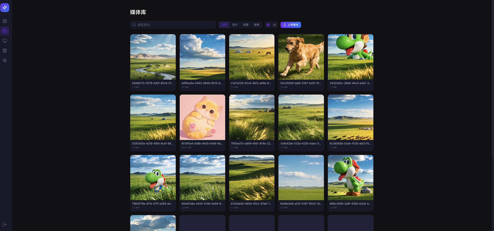

# AI Canvas Flow

可视化 AI 视频创作工作流平台 — 通过拖拽节点编排 AI 推理流程，结合时间轴编辑器完成视频创作。

## 项目结构

```
AI_Canvas_Flow/
├── frontend/          # 前端项目 (React + Vite + TypeScript)
├── backend_nest/      # 后端项目 - NestJS 版（主力，NestJS + TypeORM + BullMQ）
├── backend/           # 后端项目 - Python 版（兼容备份，FastAPI + LangGraph + Celery）
├── docs/              # 项目文档
└── README.md
```

> 后端提供两个实现版本，API 接口完全兼容：
>
> - **NestJS 版** (`backend_nest/`) ⭐ **主力服务**：NestJS + TypeORM + BullMQ + Redis（无需 RabbitMQ，Worker 内嵌应用进程）
> - **Python 版** (`backend/`) 兼容备份：FastAPI + SQLAlchemy + Celery + RabbitMQ（已归档至 `backup/python-backend` 分支）

## 功能特性

- **工作流编辑器**：基于 React Flow 的无限画布，5 类 16 种节点类型，拖拽/点击添加，连线编排
- **工作流编排引擎**：单节点执行 + 全工作流拓扑排序（Kahn 算法按层并行），自动收集上游输入节点输出
- **AI 快速生成**：自然语言描述 → LLM 自动生成工作流节点/边，支持替换/追加模式，自动布局 + 参数预填
- **时间轴编辑器**：多轨道时间线（视频/音频/字幕/特效），rAF 播放循环，片段 resize/move 拖拽（吸附对齐 + 时长 tooltip + 视觉反馈）
- **视频预览**：接入选中节点 outputArtifacts，与时间轴双向联动（currentTime 跳转 + onTimeUpdate 回写）
- **AI 推理引擎**：文生图、图生视频、文生语音、高清放大、风格化、抠图、扩图；BullMQ/Celery 异步处理（视后端版本），进度实时写回 DB
- **AI 可配置系统**：多 Provider/Model 管理（OpenAI 兼容格式），首次启动自动创建默认配置，API Key 加密存储
- **撤销/重做系统**：分支式操作历史树，100 步深度，500ms 同类操作自动合并
- **自动保存与崩溃恢复**：2 秒防抖 + 30 秒定时兜底，PostgreSQL 快照（project\_snapshots 表，5 auto 上限），崩溃恢复对话框
- **媒体资产管理**：MinIO 上传/预览/分类/拖拽上传/分页/缩略图懒加载
- **渲染与导出**：前端轻量预览 + 后端 Celery 重度合成，任务创建/轮询/取消/下载
- **模板市场**：模板列表搜索/分类筛选/克隆为新项目/发布项目为模板
- **实时协作**：基于 WebSocket（Socket.IO）的多用户协同编辑，JWT 鉴权，远端光标实时同步，房间成员管理

## 技术栈

### 前端

| 类别    | 技术                              |
| ----- | ------------------------------- |
| 构建工具  | Vite 6.x                        |
| UI 框架 | React 18 + TypeScript 5.8       |
| 画布引擎  | @xyflow/react (React Flow) 12.x |
| 状态管理  | Zustand 5.x                     |
| 路由    | React Router DOM 7.x            |
| 样式    | Tailwind CSS 3.4                |
| 视频播放  | Video.js 8.x                    |
| 视频处理  | @ffmpeg/ffmpeg                  |
| 拖拽    | @dnd-kit                        |
| 实时通信  | Socket.IO Client                |
| 图标    | Lucide React                    |

### 后端（两个实现版本，API 兼容）

**NestJS 版** (`backend_nest/`) ⭐ **主力**

| 类别     | 技术                                         |
| ------ | ------------------------------------------ |
| Web 框架 | NestJS 10.4 (TypeScript)                   |
| ORM    | TypeORM 0.3 + pg                           |
| 任务队列   | BullMQ 5.12 + Redis（无需 RabbitMQ，Worker 内嵌） |
| 数据库    | PostgreSQL（复用 Python 版 schema）             |
| 对象存储   | MinIO 8.0                                  |
| 实时通信   | @nestjs/platform-socket.io                 |
| 认证     | @nestjs/jwt + passport-jwt                 |
| 视频处理   | fluent-ffmpeg                              |
| 容器化    | Docker                                     |

**Python 版** (`backend/`) 兼容备份

| 类别     | 技术                                  |
| ------ | ----------------------------------- |
| Web 框架 | FastAPI (Python 3.12+)              |
| AI 编排  | LangChain + LangGraph               |
| 任务队列   | Celery + RabbitMQ                   |
| 缓存     | Redis                               |
| 数据库    | PostgreSQL + SQLAlchemy 2.0 (async) |
| 对象存储   | MinIO                               |
| 实时通信   | python-socketio                     |
| 数据库迁移  | Alembic                             |
| 容器化    | Docker + Docker Compose             |

## 快速开始

### 前端

```bash
cd frontend

# 安装依赖
pnpm install

# 启动开发服务器
pnpm dev

# 构建
pnpm build

# 类型检查
pnpm check
```

开发服务器运行在 <http://localhost:5173>

### 后端（NestJS 版，主力）

```bash
cd backend_nest

# 安装依赖
npm install

# 配置环境变量（可直接复用 backend/.env，DATABASE_URL 自动兼容 asyncpg 前缀）
cp .env.example .env

# 启动开发服务器（watch 热重载，内嵌 BullMQ Worker，无需独立进程）
npm run start:dev
```

API 服务运行在 <http://localhost:8000，无需> RabbitMQ（BullMQ 直接使用 Redis）。
详细文档见 [backend\_nest/README.md](backend_nest/README.md)。

### 后端（Python 版，兼容备份）

```bash
cd backend

# 创建虚拟环境
python -m venv venv
source venv/bin/activate  # macOS/Linux

# 安装依赖
pip install -r requirements.txt

# 配置环境变量
cp .env.example .env
# 编辑 .env 填入实际配置

# 启动开发服务器
uvicorn app.main:app --reload --port 8000

# 启动 Celery Worker（RabbitMQ 4.x 需加兼容参数）
celery -A app.tasks.celery_app worker --loglevel=info --pool=solo \
  --without-mingle --without-gossip --without-heartbeat

# 数据库迁移
alembic upgrade head
```

API 服务运行在 <http://localhost:8000，文档地址> <http://localhost:8000/docs>

### Docker Compose（一键启动全部服务）

```bash
# 在项目根目录，默认启动 Python 后端 + 基础设施
docker compose up -d

# 启动 NestJS 后端（profile=nest，端口 8001，与 Python api 不冲突）
docker compose --profile nest up -d
```

> NestJS 后端默认使用 `8001:8000` 端口映射，避免与 Python `api` 服务的 8000 端口冲突。
> RabbitMQ 仅 Python Celery 需要，NestJS 使用 Redis BullMQ。

## 项目预览

#### 首页



#### 画布



#### 渲染中心



#### AI配置



#### 媒体库



## License

MIT
