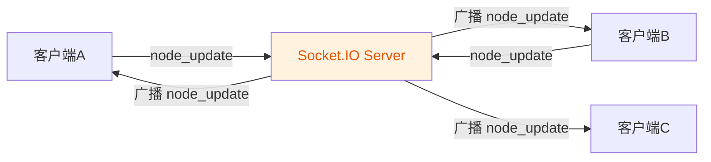
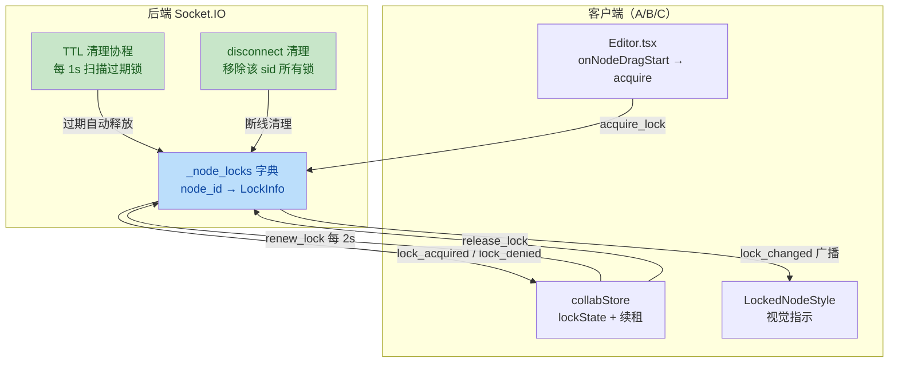
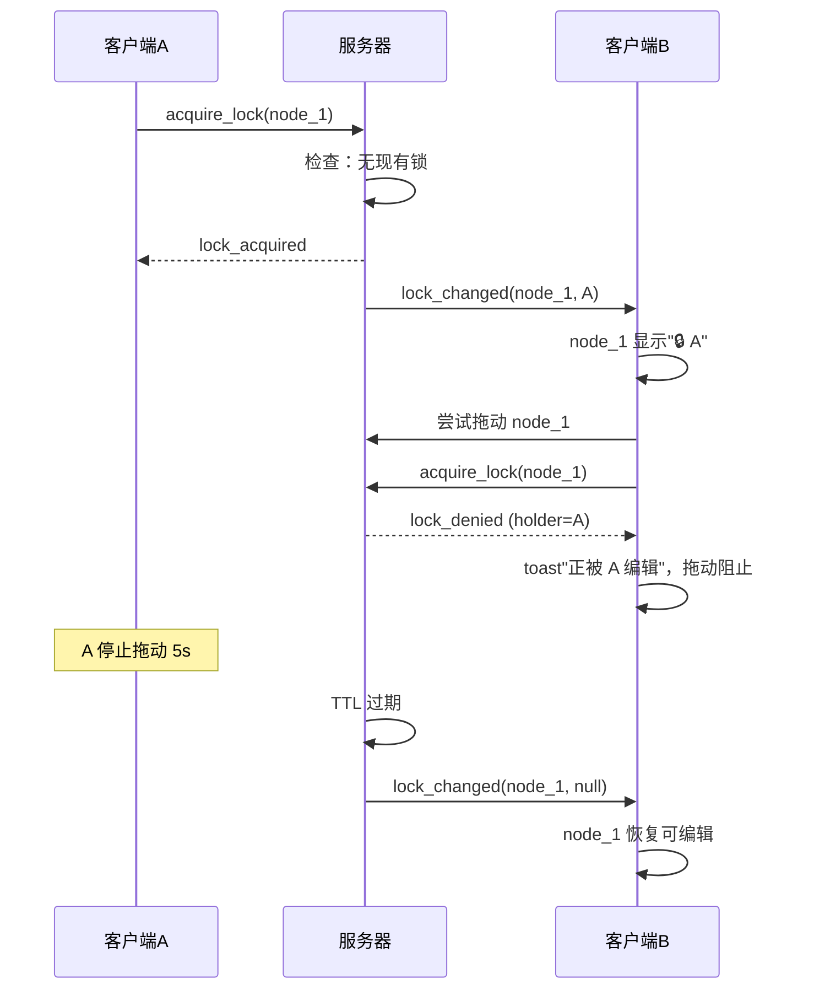
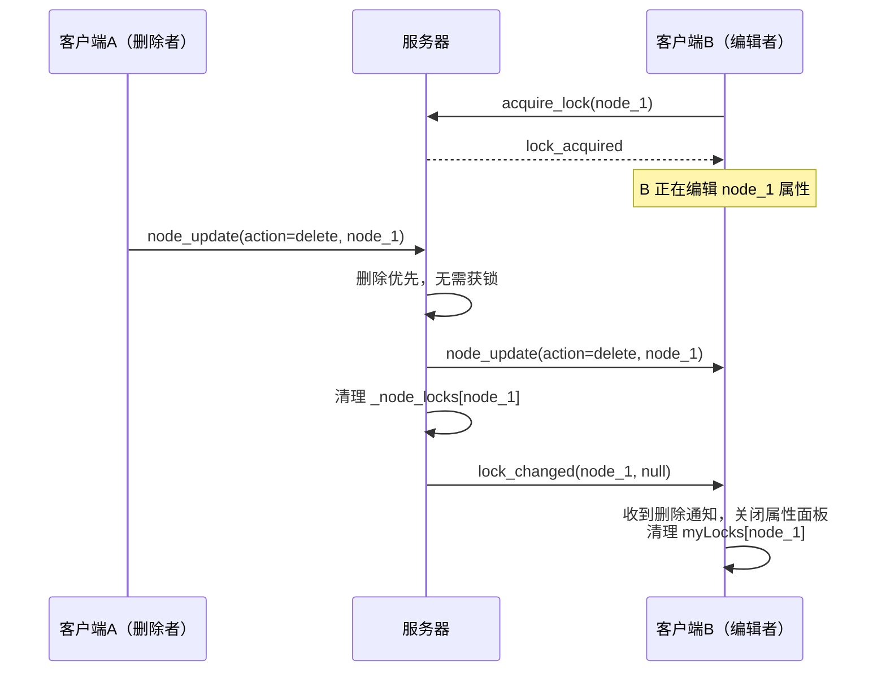

# 协作冲突解决技术方案设计

> **文档日期**: 2026-07-12
> **作者**: AI Canvas Flow 团队
> **状态**: 设计阶段（待评审）
> **关联路线图项**: P2 OT/CRDT 协作冲突解决
> **技术选型**: 轻量级节点锁（租约模型）

---

## 1. 背景与目标

### 1.1 问题陈述

当前项目的实时协作功能（`backend/app/ws/collaboration.py`）采用**纯转发广播**模式：服务器收到 `node_update` / `edge_update` 事件后，仅做权限检查（viewer 拒绝），然后直接广播给房间内其他协作者。服务器不维护任何文档状态，不检测冲突，完全依赖 last-write-wins。

这导致以下 5 类冲突场景无任何保护：

| # | 场景 | 当前不良行为 |
|---|------|--------------|
| 1 | A、B 同时拖动同一节点 | 位置闪烁/跳跃，最终位置随机 |
| 2 | A、B 同时改同一节点属性 | 后到者静默覆盖先到者，数据丢失 |
| 3 | A 删除节点时 B 正编辑该节点 | B 的更新应用到已删除节点（悬空引用） |
| 4 | A 删除节点时 B 的连线指向它 | 产生悬空边，画布渲染异常 |
| 5 | 网络抖动导致事件乱序 | 旧状态覆盖新状态 |

### 1.2 设计目标

- **预防而非检测**：通过节点锁阻止并发修改发生，而非事后检测合并
- **轻量级**：保留现有 Socket.IO 架构，不引入 CRDT 依赖，不重构数据层
- **隐式无感**：用户无需显式"申请锁"，开始编辑即自动获锁，停顿即自动释放
- **可降级**：锁服务异常时不阻塞协作基础功能（退化为当前的广播模式）

### 1.3 非目标（明确不做）

- ❌ 字段级并发编辑（A 改 prompt、B 改 size 仍互斥）——需升级"锁+版本号混合"方案
- ❌ 离线编辑合并——需 CRDT（Yjs/Automerge）
- ❌ 操作历史回溯与冲突可视化——属 P2"操作历史面板"另一独立功能
- ❌ 属性级 OT 变换——画布编辑器非富文本，OT 收益不抵成本

---

## 2. 现状分析

### 2.1 当前协作架构



**后端**（`backend/app/ws/collaboration.py`）：
- Socket.IO AsyncServer，JWT 鉴权（query string token）
- 房间管理：`_room_members: dict[str, list[dict]]` 全局字典
- `node_update` / `edge_update` 事件：权限检查后直接 `sio.emit(..., room=room, skip_sid=sid)`
- **无状态**：服务器不保存节点内容、不保存版本号、不保存操作日志

**前端**（`frontend/src/stores/collabStore.ts`）：
- `NodeUpdatePayload`: `{project_id, node_id, action, [key: string]: unknown}`——纯状态快照，无版本号
- `emitNodeUpdate(data)` → `socket.emit('node_update', data)`
- 监听 `node_update` 回调，由 Editor.tsx 应用到 React Flow

### 2.2 当前 payload 结构

```typescript
// frontend/src/stores/collabStore.ts L22-28
export interface NodeUpdatePayload {
  project_id: string;
  node_id: string;
  action: string;  // "update" | "add" | "delete"
  [key: string]: unknown;  // 直接携带节点数据
}
```

**问题**：无 `version` / `seq` / `timestamp` 字段，无法判断新旧。

---

## 3. 整体架构

### 3.1 锁状态归属

锁状态由**后端集中维护**（与现有 `_room_members` 同模式），前端通过事件申请/释放。



### 3.2 设计决策

| 决策点 | 选择 | 理由 |
|--------|------|------|
| 锁粒度 | 整个节点 | 字段级锁复杂度陡增，节点级覆盖 80% 场景 |
| 获取方式 | 隐式（开始编辑自动获取） | 显式按钮繁琐，隐式更符合"无感协作" |
| 释放方式 | TTL 超时（5s）+ 主动释放 + 断线清理 | 三重保障，防锁泄漏 |
| TTL 时长 | 5s | 平衡"操作停顿"与"锁占用时长"，续租间隔 2s |
| 强制解锁 | 仅 owner 可 force_release | 踢掉占着不动的协作者 |
| 锁状态存储 | 内存字典（非 Redis） | 与 `_room_members` 一致，单实例部署足够；多实例需升级 Redis（后续 P3） |
| 删除与锁 | 删除优先，无需获锁 | 删除是破坏性操作，不应被锁阻塞；广播 `node_deleted` 通知持锁者 |

---

## 4. 数据结构定义

### 4.1 后端锁状态

```python
# backend/app/ws/collaboration.py 新增

import time
from dataclasses import dataclass, field

@dataclass
class NodeLock:
    """节点锁信息"""
    node_id: str
    project_id: str
    sid: str              # 持锁者 Socket.IO sid
    user_id: str
    username: str
    acquired_at: float    # 获取时间戳（秒）
    expires_at: float     # 过期时间戳（秒）= acquired_at + LOCK_TTL
    last_renewed: float   # 最后续租时间

    def is_expired(self, now: float | None = None) -> bool:
        now = now if now is not None else time.time()
        return now >= self.expires_at

    def renew(self, ttl: float) -> None:
        """续租：刷新过期时间"""
        self.last_renewed = time.time()
        self.expires_at = self.last_renewed + ttl


# 全局锁状态：key = (project_id, node_id)，value = NodeLock
_node_locks: dict[tuple[str, str], NodeLock] = {}

# 配置常量
LOCK_TTL: float = 5.0          # 锁存活时长（秒）
LOCK_RENEW_INTERVAL: float = 2.0  # 客户端续租间隔（秒）
LOCK_CLEANUP_INTERVAL: float = 1.0  # 后端清理协程扫描间隔（秒）
```

### 4.2 前端锁状态

```typescript
// frontend/src/stores/collabStore.ts 新增类型

/** 节点锁信息（对齐后端 NodeLock） */
export interface NodeLockInfo {
  node_id: string;
  project_id: string;
  sid: string;
  user_id: string;
  username: string;
  acquired_at: number;
  expires_at: number;
}

/** 锁操作结果 */
export type LockResult =
  | { ok: true; lock: NodeLockInfo }
  | { ok: false; reason: 'locked_by_other'; holder: NodeLockInfo }
  | { ok: false; reason: 'permission_denied' }
  | { ok: false; reason: 'error'; message: string };

/** collabStore 新增字段 */
interface CollabLockState {
  // 当前项目所有节点的锁状态：node_id → lock info
  nodeLocks: Record<string, NodeLockInfo>;
  // 本客户端持有的锁：node_id → 锁信息（用于续租）
  myLocks: Record<string, NodeLockInfo>;
  // 续租定时器引用
  _renewTimer: ReturnType<typeof setInterval> | null;

  // 锁操作方法
  acquireLock: (nodeId: string) => Promise<LockResult>;
  renewLock: (nodeId: string) => Promise<boolean>;
  releaseLock: (nodeId: string) => Promise<void>;
  forceReleaseLock: (nodeId: string) => Promise<boolean>;

  // 锁状态查询
  isNodeLocked: (nodeId: string) => boolean;
  isNodeLockedByMe: (nodeId: string) => boolean;
  getNodeLockHolder: (nodeId: string) => NodeLockInfo | null;

  // 续租定时器（内部方法，但需在接口声明以通过 TS 类型检查）
  _startRenewTimer: () => void;
  _stopRenewTimer: () => void;

  // 事件订阅
  onLockChanged: (cb: (payload: { node_id: string; lock: NodeLockInfo | null }) => void) => () => void;
}
```

---

## 5. 事件协议定义

### 5.1 完整事件清单

**客户端 → 服务器事件（socket.emit）**

| 事件名 | 触发时机 | ack 返回 |
|--------|----------|----------|
| `acquire_lock` | 客户端开始编辑节点 | `LockResult`（成功含锁信息；失败含 reason + holder） |
| `renew_lock` | 每 2s 续租（持锁期间） | `{ok: boolean, expires_at?: number}` |
| `release_lock` | 客户端停止编辑 | `{ok: boolean}` |
| `force_release` | owner 强制解锁 | `{ok: boolean, message?: string}` |

**服务器 → 客户端广播事件（sio.emit room）**

| 事件名 | 触发时机 | payload |
|--------|----------|---------|
| `lock_changed` | 锁状态变化（获取/续租/释放/TTL 过期/断线清理/强制解锁/节点删除） | `{project_id, node_id, lock: NodeLockInfo \| null}`（lock=null 表示释放） |

> **说明**：`lock_acquired` / `lock_denied` 不是独立事件，而是 `acquire_lock` 的 ack 返回值（见 6.2 实现）。锁释放统一通过 `lock_changed`（lock=null）广播，不单独发 `lock_released`。`node_deleted` 复用现有 `node_update`（action=delete），非新事件。

### 5.2 Payload 定义

```typescript
// acquire_lock: C→S
interface AcquireLockPayload {
  project_id: string;
  node_id: string;
}
// ack 返回: LockResult（见 4.2）

// lock_changed: S→广播
interface LockChangedPayload {
  project_id: string;
  node_id: string;
  lock: NodeLockInfo | null;  // null 表示锁已释放
}

// renew_lock: C→S
interface RenewLockPayload {
  project_id: string;
  node_id: string;
}
// ack 返回: { ok: boolean, expires_at?: number }

// release_lock: C→S
interface ReleaseLockPayload {
  project_id: string;
  node_id: string;
}
// ack 返回: { ok: boolean }

// force_release: C→S（仅 owner）
interface ForceReleasePayload {
  project_id: string;
  node_id: string;
}
// ack 返回: { ok: boolean, message?: string }
```

---

## 6. 后端实现

### 6.1 锁状态管理工具函数

```python
# backend/app/ws/collaboration.py 新增

def _lock_key(project_id: str, node_id: str) -> tuple[str, str]:
    return (project_id, node_id)


def _get_active_lock(project_id: str, node_id: str) -> NodeLock | None:
    """获取节点的有效锁（已过期的视为无锁并清理）"""
    key = _lock_key(project_id, node_id)
    lock = _node_locks.get(key)
    if lock is None:
        return None
    if lock.is_expired():
        _node_locks.pop(key, None)
        return None
    return lock


def _purge_expired_locks() -> list[NodeLock]:
    """清理所有过期锁，返回被清理的锁列表（用于广播释放事件）"""
    now = time.time()
    expired = [lock for lock in _node_locks.values() if lock.is_expired(now)]
    for lock in expired:
        _node_locks.pop(_lock_key(lock.project_id, lock.node_id), None)
    return expired


def _remove_locks_by_sid(sid: str) -> list[NodeLock]:
    """移除某 sid 持有的所有锁（断线清理），返回被移除的锁列表"""
    removed = [lock for lock in _node_locks.values() if lock.sid == sid]
    for lock in removed:
        _node_locks.pop(_lock_key(lock.project_id, lock.node_id), None)
    return removed


def _lock_to_dict(lock: NodeLock) -> dict:
    """NodeLock → 可序列化 dict（用于事件 payload）"""
    return {
        "node_id": lock.node_id,
        "project_id": lock.project_id,
        "sid": lock.sid,
        "user_id": lock.user_id,
        "username": lock.username,
        "acquired_at": lock.acquired_at,
        "expires_at": lock.expires_at,
    }
```

### 6.2 事件处理函数

```python
# backend/app/ws/collaboration.py 新增事件

@sio.on("acquire_lock")
async def acquire_lock(sid, data):
    """申请节点锁

    流程：
    1. 权限检查（viewer 不可锁）
    2. 检查节点是否已被他人锁定（且未过期）
    3. 未锁 → 创建 NodeLock → 广播 lock_changed → 返回 lock_acquired
    4. 已锁 → 返回 lock_denied（含持锁者信息）
    """
    project_id = data.get("project_id")
    node_id = data.get("node_id")
    if not project_id or not node_id:
        return {"ok": False, "reason": "error", "message": "缺少 project_id 或 node_id"}

    session = await _get_session_info(sid)
    user_id = session.get("user_id", "unknown")
    username = session.get("username", "unknown")

    # 权限检查
    if not await _check_edit_permission(project_id, user_id):
        return {"ok": False, "reason": "permission_denied"}

    # 检查现有锁
    existing = _get_active_lock(project_id, node_id)
    if existing:
        if existing.sid == sid:
            # 自己已持锁，续租并返回
            existing.renew(LOCK_TTL)
            return {"ok": True, "lock": _lock_to_dict(existing)}
        # 他人持锁
        return {"ok": False, "reason": "locked_by_other", "holder": _lock_to_dict(existing)}

    # 创建新锁
    now = time.time()
    lock = NodeLock(
        node_id=node_id,
        project_id=project_id,
        sid=sid,
        user_id=user_id,
        username=username,
        acquired_at=now,
        expires_at=now + LOCK_TTL,
        last_renewed=now,
    )
    _node_locks[_lock_key(project_id, node_id)] = lock

    room = f"project:{project_id}"
    await sio.emit("lock_changed", {
        "project_id": project_id,
        "node_id": node_id,
        "lock": _lock_to_dict(lock),
    }, room=room)

    logger.debug(f"[WS:Lock] acquire sid={sid} user={username} node={node_id}")
    return {"ok": True, "lock": _lock_to_dict(lock)}


@sio.on("renew_lock")
async def renew_lock(sid, data):
    """续租节点锁"""
    project_id = data.get("project_id")
    node_id = data.get("node_id")
    lock = _node_locks.get(_lock_key(project_id, node_id))

    if not lock or lock.sid != sid:
        # 锁不存在或不属于自己（可能已过期被清理）
        return {"ok": False}

    lock.renew(LOCK_TTL)
    return {"ok": True, "expires_at": lock.expires_at}


@sio.on("release_lock")
async def release_lock(sid, data):
    """主动释放节点锁"""
    project_id = data.get("project_id")
    node_id = data.get("node_id")
    key = _lock_key(project_id, node_id)
    lock = _node_locks.get(key)

    if not lock or lock.sid != sid:
        return {"ok": False}

    _node_locks.pop(key, None)
    room = f"project:{project_id}"
    await sio.emit("lock_changed", {
        "project_id": project_id,
        "node_id": node_id,
        "lock": None,  # null 表示释放
    }, room=room)

    logger.debug(f"[WS:Lock] release sid={sid} node={node_id}")
    return {"ok": True}


@sio.on("force_release")
async def force_release(sid, data):
    """强制解锁（仅 owner）"""
    project_id = data.get("project_id")
    node_id = data.get("node_id")
    session = await _get_session_info(sid)
    user_id = session.get("user_id", "unknown")

    # 检查是否为项目 owner
    async with async_session_factory() as db:
        project = await db.get(Project, uuid.UUID(project_id))
        if not project or str(project.owner_id) != user_id:
            return {"ok": False, "message": "仅项目所有者可强制解锁"}

    key = _lock_key(project_id, node_id)
    lock = _node_locks.pop(key, None)
    if lock:
        room = f"project:{project_id}"
        await sio.emit("lock_changed", {
            "project_id": project_id,
            "node_id": node_id,
            "lock": None,
        }, room=room)
        logger.info(f"[WS:Lock] force_release by owner sid={sid} node={node_id} old_holder={lock.username}")
    return {"ok": True}
```

### 6.3 TTL 清理协程

```python
# backend/app/ws/collaboration.py 新增

async def _lock_cleanup_loop():
    """后台协程：定期清理过期锁并广播释放事件

    在 FastAPI startup 事件中启动（app.main 的 lifespan）
    """
    logger.info("[WS:Lock] TTL 清理协程已启动")
    while True:
        await asyncio.sleep(LOCK_CLEANUP_INTERVAL)
        try:
            expired = _purge_expired_locks()
            for lock in expired:
                room = f"project:{lock.project_id}"
                await sio.emit("lock_changed", {
                    "project_id": lock.project_id,
                    "node_id": lock.node_id,
                    "lock": None,
                }, room=room)
                logger.debug(
                    f"[WS:Lock] TTL 过期释放 node={lock.node_id} "
                    f"user={lock.username} held={time.time() - lock.acquired_at:.1f}s"
                )
        except Exception as e:
            logger.warning(f"[WS:Lock] 清理协程异常: {e}")
```

### 6.4 disconnect 清理

在现有 `disconnect` 事件处理中追加锁清理逻辑：

```python
# backend/app/ws/collaboration.py 修改 disconnect 事件

@sio.event
async def disconnect(sid):
    """客户端断开事件 — 清理房间成员 + 释放持有的锁"""
    session = await _get_session_info(sid)
    user_id = session.get("user_id", "unknown")
    rooms = sio.rooms(sid)
    logger.info(f"[WS:Disconnect] sid={sid} user={user_id} rooms={rooms}")

    # 1. 清理房间成员（现有逻辑）
    for room in list(_room_members.keys()):
        removed = _remove_member_from_room(sid, room)
        if removed:
            try:
                await sio.leave_room(sid, room)
            except Exception as e:
                logger.debug(f"清理操作失败: {e}")
            await sio.emit(
                "user_left",
                {"user_id": removed["user_id"], "username": removed["username"], "sid": sid},
                room=room,
            )

    # 2. 清理该 sid 持有的所有锁（新增）
    released = _remove_locks_by_sid(sid)
    for lock in released:
        room = f"project:{lock.project_id}"
        await sio.emit("lock_changed", {
            "project_id": lock.project_id,
            "node_id": lock.node_id,
            "lock": None,
        }, room=room)
    if released:
        logger.info(f"[WS:Lock] 断线清理 sid={sid} 释放 {len(released)} 个锁")
```

### 6.5 启动清理协程

```python
# backend/app/main.py 的 lifespan 中追加

from app.ws.collaboration import sio, _lock_cleanup_loop

@asynccontextmanager
async def lifespan(app: FastAPI):
    # ... 现有初始化 ...
    # 启动锁 TTL 清理协程
    asyncio.create_task(_lock_cleanup_loop())
    yield
    # ... 现有清理 ...
```

### 6.6 删除节点时通知持锁者

修改现有 `node_update` 事件，当 `action == "delete"` 时，清理该节点的锁：

```python
# backend/app/ws/collaboration.py 修改 node_update 事件

@sio.on("node_update")
async def node_update(sid, data):
    project_id = data.get("project_id")
    node_id = data.get("node_id", "?")
    action = data.get("action", "update")

    if not project_id:
        return

    session = await _get_session_info(sid)
    user_id = session.get("user_id", "unknown")

    if not await _check_edit_permission(project_id, user_id):
        await sio.emit("error", {"message": "查看者无法编辑"}, room=sid)
        return

    room = f"project:{project_id}"
    await sio.emit("node_update", data, room=room, skip_sid=sid)

    # 删除节点时清理关联锁（新增）
    if action == "delete":
        lock = _node_locks.pop(_lock_key(project_id, node_id), None)
        if lock:
            logger.debug(f"[WS:Lock] 节点删除清理锁 node={node_id} holder={lock.username}")
        # 同时清理指向该节点的边的锁（边无锁，但需清理悬空边）
```

---

## 7. 前端实现

### 7.1 collabStore 扩展

```typescript
// frontend/src/stores/collabStore.ts 新增

// 在 CollabState 接口中追加（见 4.2 类型定义）

// 实现部分：
acquireLock: async (nodeId: string): Promise<LockResult> => {
  const { socket, currentProjectId } = get();
  if (!socket || !currentProjectId) {
    return { ok: false, reason: 'error', message: '未连接' };
  }
  return new Promise((resolve) => {
    socket.emit(
      'acquire_lock',
      { project_id: currentProjectId, node_id: nodeId },
      (ack: LockResult) => {
        if (ack.ok) {
          // 记录到自己持有的锁
          set((state) => ({
            myLocks: { ...state.myLocks, [nodeId]: ack.lock },
            nodeLocks: { ...state.nodeLocks, [nodeId]: ack.lock },
          }));
          // 启动续租定时器
          get()._startRenewTimer();
        } else if (ack.reason === 'locked_by_other') {
          // 记录他人锁到 nodeLocks（用于 UI 显示）
          set((state) => ({
            nodeLocks: { ...state.nodeLocks, [nodeId]: ack.holder },
          }));
        }
        resolve(ack);
      },
    );
  });
},

renewLock: async (nodeId: string): Promise<boolean> => {
  const { socket, currentProjectId, myLocks } = get();
  if (!socket || !currentProjectId || !myLocks[nodeId]) return false;
  return new Promise((resolve) => {
    socket.emit(
      'renew_lock',
      { project_id: currentProjectId, node_id: nodeId },
      (ack: { ok: boolean; expires_at?: number }) => {
        if (ack.ok && ack.expires_at) {
          set((state) => ({
            myLocks: {
              ...state.myLocks,
              [nodeId]: { ...state.myLocks[nodeId], expires_at: ack.expires_at! },
            },
          }));
        }
        resolve(ack.ok);
      },
    );
  });
},

releaseLock: async (nodeId: string): Promise<void> => {
  const { socket, currentProjectId } = get();
  if (!socket || !currentProjectId) return;
  await new Promise<void>((resolve) => {
    socket.emit(
      'release_lock',
      { project_id: currentProjectId, node_id: nodeId },
      () => {
        set((state) => {
          const myLocks = { ...state.myLocks };
          const nodeLocks = { ...state.nodeLocks };
          delete myLocks[nodeId];
          delete nodeLocks[nodeId];
          return { myLocks, nodeLocks };
        });
        resolve();
      },
    );
  });
},

// 续租定时器：每 2s 续租所有自己持有的锁
_startRenewTimer: () => {
  const { _renewTimer } = get();
  if (_renewTimer) return;  // 已启动
  const timer = setInterval(async () => {
    const { myLocks, renewLock } = get();
    const nodeIds = Object.keys(myLocks);
    if (nodeIds.length === 0) {
      // 无持锁，停止定时器
      get()._stopRenewTimer();
      return;
    }
    // 并行续租
    await Promise.all(nodeIds.map((id) => renewLock(id)));
  }, LOCK_RENEW_INTERVAL * 1000);
  set({ _renewTimer: timer });
},

_stopRenewTimer: () => {
  const { _renewTimer } = get();
  if (_renewTimer) {
    clearInterval(_renewTimer);
    set({ _renewTimer: null });
  }
},

// 查询方法
isNodeLocked: (nodeId: string) => !!get().nodeLocks[nodeId],
isNodeLockedByMe: (nodeId: string) => !!get().myLocks[nodeId],
getNodeLockHolder: (nodeId: string) => get().nodeLocks[nodeId] || null,

// 监听 lock_changed 事件
onLockChanged: (cb) => {
  const { socket } = get();
  if (!socket) return () => {};
  const handler = (payload: LockChangedPayload) => {
    set((state) => {
      const nodeLocks = { ...state.nodeLocks };
      const myLocks = { ...state.myLocks };
      if (payload.lock) {
        nodeLocks[payload.node_id] = payload.lock;
        // 如果锁被他人抢走，从 myLocks 移除
        if (myLocks[payload.node_id] && myLocks[payload.node_id].sid !== payload.lock.sid) {
          delete myLocks[payload.node_id];
        }
      } else {
        delete nodeLocks[payload.node_id];
        delete myLocks[payload.node_id];
      }
      return { nodeLocks, myLocks };
    });
    cb(payload);
  };
  socket.on('lock_changed', handler);
  return () => socket.off('lock_changed', handler);
},
```

### 7.2 Editor.tsx 集成

```typescript
// frontend/src/components/Editor.tsx 新增

import { useCollabStore } from '@/stores/collabStore';

// 在组件内
const { acquireLock, releaseLock, isNodeLocked, isNodeLockedByMe, getNodeLockHolder, onLockChanged } = useCollabStore();

// 订阅 lock_changed 事件（触发 React Flow 重渲染）
useEffect(() => {
  const unsub = onLockChanged(() => {
    // 触发 nodes 重渲染（通过更新 node.data 的 locked 状态）
    setNodes((nds) =>
      nds.map((n) => {
        const locked = isNodeLocked(n.id) && !isNodeLockedByMe(n.id);
        const holder = getNodeLockHolder(n.id);
        return {
          ...n,
          data: { ...n.data, _locked: locked, _lockHolder: holder?.username || null },
        };
      }),
    );
  });
  return unsub;
}, []);

// 每个节点的延迟释放定时器（node_id → timer），避免连续拖动时误释放
const releaseTimersRef = useRef<Record<string, ReturnType<typeof setTimeout>>>({});

// 拖动开始时加锁
const onNodeDragStart = useCallback(async (evt, node) => {
  // 清除该节点待执行的延迟释放定时器（连续拖动场景）
  const oldTimer = releaseTimersRef.current[node.id];
  if (oldTimer) {
    clearTimeout(oldTimer);
    delete releaseTimersRef.current[node.id];
  }
  // 先检查是否被他人锁定
  if (isNodeLocked(node.id) && !isNodeLockedByMe(node.id)) {
    const holder = getNodeLockHolder(node.id);
    toast.warning(`节点正被 ${holder?.username} 编辑`);
    return;  // 阻止拖动（React Flow 会自动回弹）
  }
  const result = await acquireLock(node.id);
  if (!result.ok && result.reason === 'locked_by_other') {
    toast.info(`节点正被 ${result.holder.username} 编辑，请稍后`);
  }
}, [acquireLock, isNodeLocked, isNodeLockedByMe, getNodeLockHolder]);

// 拖动结束 3s 后释放（给连续微调留时间）
const onNodeDragStop = useCallback(async (evt, node) => {
  // 清除旧的待执行定时器（防重复）
  const oldTimer = releaseTimersRef.current[node.id];
  if (oldTimer) clearTimeout(oldTimer);
  // 设置新的延迟释放
  releaseTimersRef.current[node.id] = setTimeout(async () => {
    if (isNodeLockedByMe(node.id)) {
      await releaseLock(node.id);
    }
    delete releaseTimersRef.current[node.id];
  }, 3000);
}, [releaseLock, isNodeLockedByMe]);

// 属性面板输入获焦加锁
const onPropertyFocus = useCallback(async (nodeId: string) => {
  if (isNodeLocked(nodeId) && !isNodeLockedByMe(nodeId)) {
    const holder = getNodeLockHolder(nodeId);
    toast.warning(`节点正被 ${holder?.username} 编辑`);
    return false;
  }
  const result = await acquireLock(nodeId);
  return result.ok;
}, [acquireLock, isNodeLocked, isNodeLockedByMe, getNodeLockHolder]);

// 属性面板失焦释放
const onPropertyBlur = useCallback(async (nodeId: string) => {
  if (isNodeLockedByMe(nodeId)) {
    await releaseLock(nodeId);
  }
}, [releaseLock, isNodeLockedByMe]);
```

### 7.3 锁定节点视觉样式

```typescript
// frontend/src/components/canvas/LockedNodeStyle.tsx 新增

import { memo } from 'react';
import { Handle, Position } from 'reactflow';

interface LockedNodeProps {
  data: {
    label: string;
    _locked?: boolean;
    _lockHolder?: string | null;
    [key: string]: unknown;
  };
  selected: boolean;
}

/** 锁定状态节点样式：橙色边框 + 右上角锁图标角标 */
const LockedNode = memo(({ data, selected }: LockedNodeProps) => {
  const isLocked = data._locked;
  return (
    <div
      className={[
        'relative rounded-lg border-2 px-3 py-2 transition-colors',
        isLocked
          ? 'border-orange-400 bg-orange-50 cursor-not-allowed'
          : selected
            ? 'border-blue-500 bg-white'
            : 'border-gray-300 bg-white',
      ].join(' ')}
    >
      {/* 右上角锁角标 */}
      {isLocked && (
        <div className="absolute -top-2 -right-2 flex items-center gap-1 rounded-full bg-orange-500 px-2 py-0.5 text-xs text-white shadow">
          <span>🔒</span>
          <span className="max-w-[80px] truncate">{data._lockHolder}</span>
        </div>
      )}
      <div className="text-sm font-medium">{data.label}</div>
      <Handle type="target" position={Position.Top} />
      <Handle type="source" position={Position.Bottom} />
    </div>
  );
});

export default LockedNode;
```

```typescript
// frontend/src/components/Editor.tsx 注册 nodeTypes

import LockedNode from './canvas/LockedNodeStyle';

const nodeTypes = {
  default: LockedNode,  // 用统一样式替代默认，根据 _locked 切换
  // ... 其他自定义类型
};
```

### 7.4 顶部协作状态提示条

```typescript
// frontend/src/components/CollaborationStatusBar.tsx 新增（精简版）

import { useCollabStore } from '@/stores/collabStore';

export function CollaborationStatusBar({ projectId }: { projectId: string }) {
  const myLocks = useCollabStore((s) => s.myLocks);
  const nodeLocks = useCollabStore((s) => s.nodeLocks);
  const onlineUsers = useCollabStore((s) => s.onlineUsers);

  const myLockCount = Object.keys(myLocks).length;
  const otherLockCount = Object.values(nodeLocks).filter(
    (l) => !myLocks[l.node_id],
  ).length;

  if (myLockCount === 0 && otherLockCount === 0) return null;

  return (
    <div className="flex items-center gap-3 border-b border-gray-200 bg-gray-50 px-4 py-1.5 text-xs text-gray-600">
      {myLockCount > 0 && (
        <span className="text-blue-600">
          你正在编辑 {myLockCount} 个节点
        </span>
      )}
      {otherLockCount > 0 && (
        <span className="text-orange-600">
          {otherLockCount} 个节点被他人锁定
        </span>
      )}
      <span className="ml-auto text-gray-400">
        在线 {onlineUsers.length} 人
      </span>
    </div>
  );
}
```

---

## 8. 冲突场景处理流程

### 8.1 场景 1：同时拖动同一节点



### 8.2 场景 3：删除时他人正编辑



### 8.3 场景 5：网络乱序

- 锁带 TTL，不依赖事件顺序
- 即使 `release_lock` 比 `renew_lock` 先到达，TTL 仍会兜底
- 客户端续租失败（`renew_lock` 返回 ok=false）时，立即停止本地编辑并提示"锁已失效"

---

## 9. 边界与降级

### 9.1 锁泄漏防护

| 场景 | 防护机制 |
|------|----------|
| 客户端崩溃未发 release | TTL 5s 自动过期 |
| 客户端断网 | disconnect 事件清理（Socket.IO 心跳检测 ~25s）+ TTL 兜底 |
| 后端重启 | 内存字典丢失，所有锁自动"释放"（客户端续租失败后降级为无锁模式） |
| 续租定时器漏执行 | TTL > 续租间隔（5s > 2s），容忍 1 次漏续租 |

### 9.2 降级策略

- **锁服务异常**：客户端 `acquireLock` 超时（3s）后，降级为"无锁模式"（当前行为），记录 warning 日志
- **锁状态不一致**：客户端每 10s 全量同步锁状态（通过 `join_project` ack 返回当前所有锁）
- **多实例部署**：当前内存字典仅适用单实例。多实例需升级为 Redis 存储（后续 P3 工作流状态快照存入 Redis 时一并迁移）

### 9.3 join_project 全量同步

```python
# backend/app/ws/collaboration.py 修改 join_project ack

@sio.on("join_project")
async def join_project(sid, data):
    # ... 现有逻辑 ...
    room = f"project:{project_id}"

    # 返回当前房间在线用户 + 所有锁状态（新增）
    project_locks = [
        _lock_to_dict(lock)
        for lock in _node_locks.values()
        if lock.project_id == project_id and not lock.is_expired()
    ]
    return {
        "users": _room_members.get(room, []),
        "locks": project_locks,  # 新增
    }
```

```typescript
// frontend/src/stores/collabStore.ts 修改 joinProject

joinProject: () => {
  const { socket, currentProjectId } = get();
  socket?.emit('join_project', { project_id: currentProjectId }, (ack: JoinProjectAck) => {
    set({
      onlineUsers: ack.users,
      nodeLocks: Object.fromEntries(
        (ack.locks || []).map((l) => [l.node_id, l]),
      ),  // 全量同步锁状态
    });
  });
},
```

---

## 10. 测试策略

### 10.1 后端单元测试

```python
# backend/tests/test_collaboration_locks.py

import pytest
import time
from app.ws.collaboration import (
    NodeLock, _node_locks, _get_active_lock,
    _purge_expired_locks, _remove_locks_by_sid, LOCK_TTL,
)

class TestNodeLock:
    def test_lock_not_expired(self):
        now = time.time()
        lock = NodeLock("n1", "p1", "sid1", "u1", "user1", now, now + 5, now)
        assert not lock.is_expired(now)

    def test_lock_expired(self):
        now = time.time()
        lock = NodeLock("n1", "p1", "sid1", "u1", "user1", now, now - 1, now)
        assert lock.is_expired(now)

    def test_renew_extends_expiry(self):
        lock = NodeLock("n1", "p1", "sid1", "u1", "user1", 0, 1, 0)
        lock.renew(5.0)
        assert lock.expires_at > 5


class TestPurgeExpired:
    def test_purge_removes_expired_only(self):
        now = time.time()
        active = NodeLock("n1", "p1", "s1", "u1", "a", now, now + 5, now)
        expired = NodeLock("n2", "p1", "s2", "u2", "b", now, now - 1, now)
        _node_locks.clear()
        _node_locks[("p1", "n1")] = active
        _node_locks[("p1", "n2")] = expired
        removed = _purge_expired_locks()
        assert len(removed) == 1
        assert removed[0].node_id == "n2"
        assert ("p1", "n1") in _node_locks
        assert ("p1", "n2") not in _node_locks


class TestRemoveBySid:
    def test_remove_all_locks_of_sid(self):
        now = time.time()
        l1 = NodeLock("n1", "p1", "s1", "u1", "a", now, now + 5, now)
        l2 = NodeLock("n2", "p1", "s1", "u1", "a", now, now + 5, now)
        l3 = NodeLock("n3", "p1", "s2", "u2", "b", now, now + 5, now)
        _node_locks.clear()
        _node_locks[("p1", "n1")] = l1
        _node_locks[("p1", "n2")] = l2
        _node_locks[("p1", "n3")] = l3
        removed = _remove_locks_by_sid("s1")
        assert len(removed) == 2
        assert ("p1", "n3") in _node_locks  # s2 的锁保留
```

### 10.2 前端 store 单元测试

```typescript
// frontend/src/stores/__tests__/collabStore.locks.test.ts

import { useCollabStore } from '../collabStore';

describe('collabStore 锁状态', () => {
  beforeEach(() => {
    useCollabStore.setState({ nodeLocks: {}, myLocks: {} });
  });

  it('isNodeLocked 返回正确状态', () => {
    useCollabStore.setState({
      nodeLocks: { n1: { node_id: 'n1', sid: 'other', username: 'A' } as any },
    });
    expect(useCollabStore.getState().isNodeLocked('n1')).toBe(true);
    expect(useCollabStore.getState().isNodeLocked('n2')).toBe(false);
  });

  it('isNodeLockedByMe 区分自己与他人', () => {
    useCollabStore.setState({
      myLocks: { n1: { node_id: 'n1', sid: 'me' } as any },
      nodeLocks: {
        n1: { node_id: 'n1', sid: 'me' } as any,
        n2: { node_id: 'n2', sid: 'other' } as any,
      },
    });
    expect(useCollabStore.getState().isNodeLockedByMe('n1')).toBe(true);
    expect(useCollabStore.getState().isNodeLockedByMe('n2')).toBe(false);
  });
});
```

---

## 11. 工作量评估

| 模块 | 工作项 | 新增代码 | 复杂度 |
|------|--------|----------|--------|
| 后端 ws | NodeLock 数据类 + 工具函数 + 4 事件 + TTL 协程 + disconnect 清理 + node_update 删除清理 | ~280 行 | 中 |
| 后端 main.py | 启动 TTL 清理协程 | ~5 行 | 低 |
| 前端 collabStore | 锁状态 + acquire/renew/release + 续租定时器 + onLockChanged + joinProject 全量同步 | ~180 行 | 中 |
| 前端 Editor.tsx | onNodeDragStart/Stop 加锁 + PropertyPanel focus/blur 加锁 + lock_changed 订阅 | ~120 行 | 中 |
| 前端 LockedNodeStyle | 锁定节点视觉组件 | ~60 行 | 低 |
| 前端 CollaborationStatusBar | 顶部状态条 | ~40 行 | 低 |
| 后端测试 | NodeLock + purge + removeBySid 单测 | ~120 行 | 低 |
| 前端测试 | store 锁状态单测 | ~80 行 | 低 |
| **合计** | | **~885 行** | **2-3 天** |

---

## 12. 实施里程碑

| 阶段 | 内容 | 验收标准 |
|------|------|----------|
| M1 | 后端锁核心 + 事件 + TTL | 后端单测全通过，手工用 socket.io client 验证 acquire/release/TTL |
| M2 | 前端 store + Editor 集成 | 双开浏览器，A 拖动时 B 看到"🔒 A"，B 拖动被阻止 |
| M3 | 视觉样式 + 状态条 + 全量同步 | join_project 后立即显示已有锁，断线重连锁状态正确 |
| M4 | 测试补全 + 边界验证 | 删除节点清理锁、断线清理锁、owner 强制解锁均验证通过 |

---

## 13. 与现有约束的关系

- **不破坏现有 `_room_members` 架构**：`_node_locks` 与之并行，同样的内存字典模式
- **不改变 `node_update` / `edge_update` 协议**：锁是叠加层，不修改现有事件 payload（向后兼容）
- **不引入新依赖**：纯 Socket.IO + Zustand，无 Yjs/Automerge
- **符合现有权限模型**：viewer 不可获锁（复用 `_check_edit_permission`），owner 可强制解锁
- **后续可升级**：若需 CRDT，锁状态可作为 Yjs awareness 的基础，迁移路径清晰

---

## 附录 A：配置常量

```python
# backend/app/config.py 可选追加（或硬编码在 collaboration.py）

class Settings:
    # ... 现有配置 ...
    COLLAB_LOCK_TTL: float = 5.0           # 锁存活时长
    COLLAB_LOCK_RENEW_INTERVAL: float = 2.0  # 续租间隔
    COLLAB_LOCK_CLEANUP_INTERVAL: float = 1.0  # 清理协程扫描间隔
```

```typescript
// frontend/src/stores/collabStore.ts

const LOCK_RENEW_INTERVAL = 2.0;  // 续租间隔（秒），对齐后端
const LOCK_ACQUIRE_TIMEOUT = 3000; // 加锁请求超时（毫秒）
```
